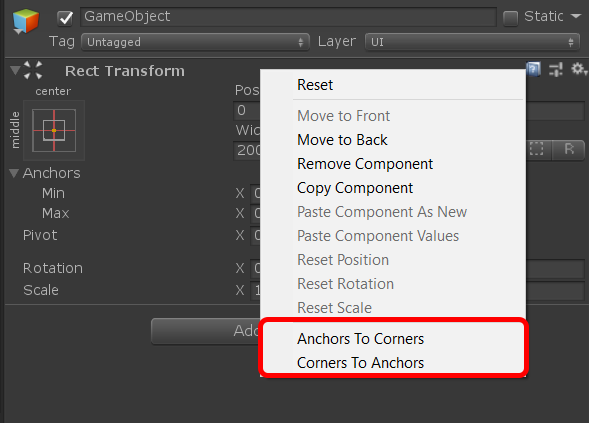
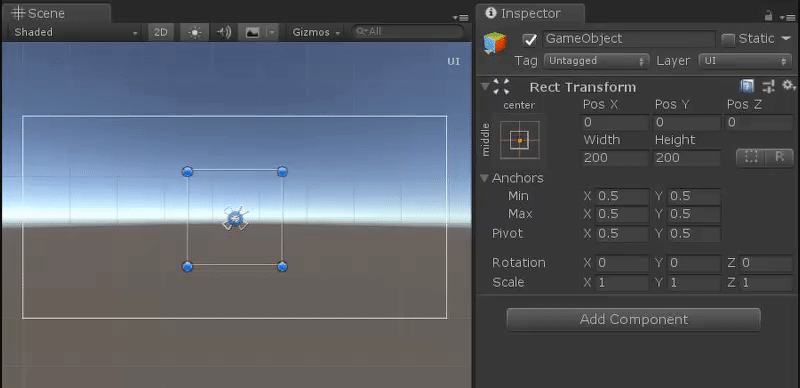
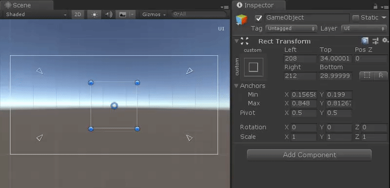

[< Back](../readme.md)

## RectTransform's Anchors and Corners

Useful context menu commands for **RectTransform** component.

Provides two additional context menu commands for **RectTransform**:
- Anchors To Corners
- Corners To Anchors

|  |
| :---: |
| **Anchors To Corners** and **Corners To Anchors** at RectTransform's context menu |

### Anchors To Corners

**Anchors To Corners** - moves Anchors to RectTransform's corners, what you can do using context menu or through the code.

|  |
| :---: |
| **Anchors To Corners** using context menu |

Example of usage, through the code.

```cs
using UGF.UI.Runtime;
using UnityEngine;

namespace Example.Runtime
{
    [RequireComponent(typeof(RectTransform))]
    public class ExampleAnchorsToCorners : MonoBehaviour
    {
        private void Start()
        {
            var rectTransform = GetComponent<RectTransform>();

            UIUtility.SetAnchorsToCorners(rectTransform);
        }
    }
}
```

### Corners To Anchors

**Corners To Anchors** - moves Corners to RectTransform's anchors, what you can do using context menu or through the code.

|  |
| :---: |
| **Corners To Anchors** using context menu |

Example of usage, through the code.

```cs
using UGF.UI.Runtime;
using UnityEngine;

namespace Example.Runtime
{
    [RequireComponent(typeof(RectTransform))]
    public class ExampleCornersToAnchors : MonoBehaviour
    {
        private void Start()
        {
            var rectTransform = GetComponent<RectTransform>();

            UIUtility.SetCornersToAnchors(rectTransform);
        }
    }
}
```

---
> Unity Game Framework | Alexander Vorobyov | Copyright 2018