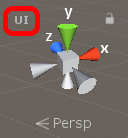
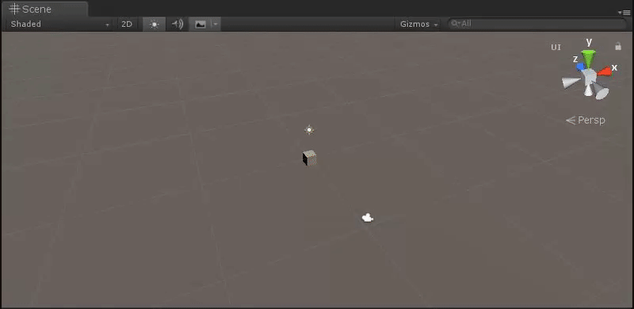

[< Back](../readme.md)

## UI Edit Mode

Isolation mode for editing the **UI**.

Adds additional button in the right corner of **Scene** window, which can be used for toggle between normal and **UI** edit mode.
What you can do by clicking on button in **Scene** window or call it through editor code.
It hides all visible layers except UI layer. When toggles button again, it reverse back to the previously visible layers, excludes **UI** layer.

|  |
| :---: |
| **UI Edit Mode** toggle button in **Scene** window |

|  |
| :---: |
| Toggle **UI Edit Mode** in **Scene** window |

Example of usage, through the editor code.

```cs
using UGF.UI.Editor;
using UnityEditor;

namespace Example.Editor
{
    public static class ExampleEditMode
    {
        [MenuItem("UI/Turn On UI Edit Mode")]
        private static void TurnOnUIEditMode()
        {
            UIEditMode.SetActive(true);
        }

        [MenuItem("UI/Turn Off UI Edit Mode")]
        private static void TurnOffUIEditMode()
        {
            UIEditMode.SetActive(false);
        }
    }
}
```

---
> Unity Game Framework | Alexander Vorobyov | Copyright 2018